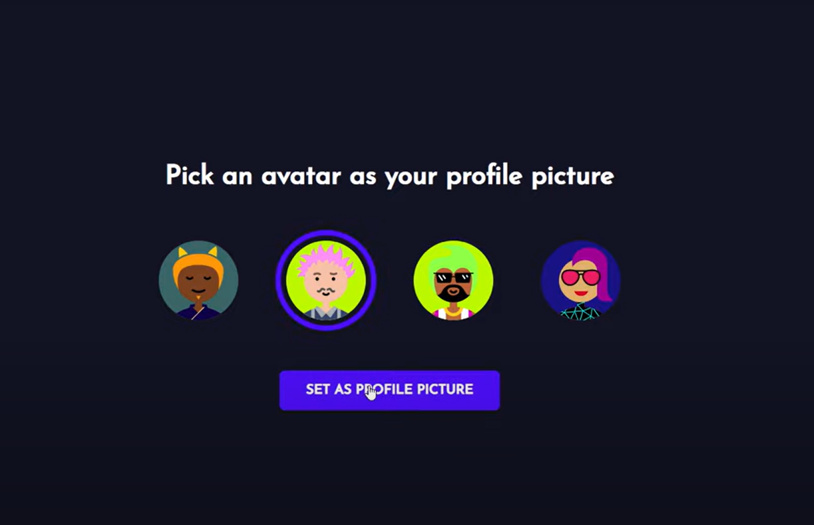

# ChatWave - Realtime Chat App

ChatWave is a full-stack, responsive chat application built with React, Node.js, Socket.IO, MongoDB, and Express. The application leverages the power of Socket.IO for real-time communication, allowing users to engage in seamless conversations.
...

# ChatWave - Realtime Chat App

ChatWave is a full-stack, responsive chat application built with React, Node.js, Socket.IO, MongoDB, and Express. The application leverages the power of Socket.IO for real-time communication, allowing users to engage in seamless conversations.

## Features

- Real-time chat: Instantly send and receive messages.
- Responsive design: Access the chat app from any device with an optimized user interface.
- Styled components: Utilizes styled components for a visually appealing and customizable UI.

## Technologies Used

- **React**: Front-end library for building user interfaces.
- **Node.js**: JavaScript runtime for server-side development.
- **Socket.IO**: Real-time web socket library for bidirectional communication.
- **MongoDB**: NoSQL database for storing chat data.
- **Express**: Web application framework for Node.js.
- **Styled Components**: CSS-in-JS library for styling React components.

## Getting Started

Follow these steps to set up and run the ChatWave application locally:

### Prerequisites

- Node.js installed on your machine
- MongoDB installed and running
- 
